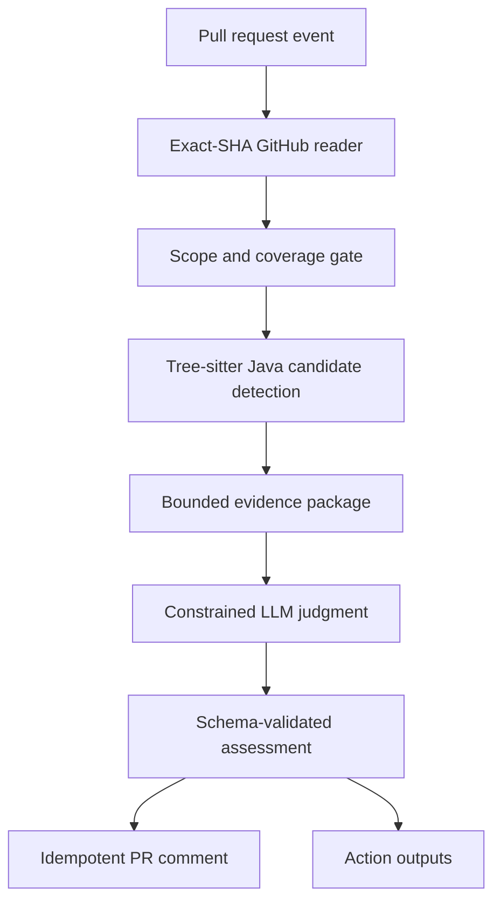

# Invariant Guardian

A safety-oriented GitHub Action that catches repository-specific architecture drift in Java/Spring pull requests without executing contributor code.

[](https://github.com/shahibag/architecture-invariant-guardian/actions/workflows/test.yml)
[](https://github.com/shahibag/architecture-invariant-guardian/releases/tag/v0.2.0)
[](LICENSE)
[](pyproject.toml)

- 📖 [Case study](docs/case-study.md)
- 🎬 [Live demo repository](https://github.com/shahibag/guardian-java-demo)
- 📊 [Offline evaluation report](tests/evaluation/reports/evaluation.md)
- ⚠️ [Known limitations](docs/known-limitations-v0.2.md)

## The problem

Generic linters and static analyzers cannot encode every repository-specific architecture decision: "persistence entities must not leak through REST boundaries" or "don't mask root-cause failures with scheduled retry loops." Architecture review is also easy to skip under delivery pressure.

Unrestricted LLM code review can invent findings, cite lines that were not changed, or opine on style and naming. Human review remains necessary, but reviewers need focused, evidence-based signals.

## The approach

Invariant Guardian reads a pull request, loads repository-owned invariants from the exact base SHA, detects candidates with deterministic Java AST analysis, and asks a constrained LLM judge to confirm or reject each candidate using bounded evidence.

```text
PR event
  ↓
Exact-SHA GitHub reader
  ↓
Scope and coverage gate
  ↓
Tree-sitter candidate detection
  ↓
Bounded evidence package
  ↓
Constrained LLM judgment
  ↓
Schema-validated assessment
  ↓
Idempotent PR comment + Action outputs
```



## Safety properties

- **No invented candidates.** The model receives only locations produced by deterministic AST analysis.
- **Fail closed.** Missing evidence, unsupported invariants, duplicate IDs, oversized context, or provider failures return `assessment_incomplete`, never a clean result.
- **No target execution.** Java source is parsed with Tree-sitter; it is never compiled, imported, or run.
- **Repository-owned policy.** Invariants live in `.guardian/invariants/` and are loaded from the exact base SHA.
- **Advisory only.** The Action emits outputs and a comment; it does not block merges by itself.

## Evidence

- **544 automated tests** pass locally and in CI.
- **53-case offline regression corpus** with positive and negative fixtures per invariant.
- **Candidate precision and recall:** 100% / 100% for both `no-domain-leak` and `no-temporary-monitoring` on the documented corpus.
- **Hosted E2E scenarios** in the demo repository cover clean, violation, remediation, unsupported, duplicate, and fork cases.
- **Exact-SHA analysis:** invariant files and related source are read from precise commits.
- **Zero target-code execution:** no `javac`, Maven, Gradle, or runtime invocation.

> Controlled regression-fixture results are not a claim of 100% accuracy on arbitrary Java repositories.

## Quick start

Add `.guardian/invariants/no-domain-leak.md` and `.guardian/invariants/no-temporary-monitoring.md` to your repository, then add a workflow:

```yaml
name: Invariant Guardian

on:
  pull_request:
    types: [opened, synchronize, reopened]

permissions:
  contents: read
  pull-requests: write

jobs:
  assess:
    runs-on: ubuntu-latest
    steps:
      - uses: actions/checkout@11d5960a326750d5838078e36cf38b85af677262
      - uses: shahibag/architecture-invariant-guardian@v0.2.0
        with:
          github-token: ${{ secrets.GITHUB_TOKEN }}
          llm-api-key: ${{ secrets.DEEPSEEK_API_KEY }}
          llm-base-url: https://api.deepseek.com
          model: deepseek-v4-flash
```

### Without an LLM key

If `llm-api-key` is omitted, deterministic candidate detection still runs, but every candidate is reported as `assessment_incomplete` because the judge cannot confirm or reject it. This is safe: the result is incomplete, not clean.

### With an LLM key

The Action sends one bounded evidence package per candidate to the configured OpenAI-compatible endpoint. Provider failures are classified and reported as `assessment_incomplete`.

## Supported scope

Version 0.2 supports exactly two repository-owned invariants:

| Invariant | What it catches |
| --- | --- |
| `no-domain-leak` | Persistence entities or internal aggregates returned from public Spring boundaries. |
| `no-temporary-monitoring` | Scheduled, retry, or polling workarounds that mask root-cause fixes. |

Arbitrary Markdown rules do **not** automatically obtain detectors. Only the two IDs above have implemented, tested detectors.

## Outputs

| Output | Description |
| --- | --- |
| `assessment-status` | `no_confirmed_violations`, `confirmed_violations`, or `assessment_incomplete` |
| `confirmed-count` | Number of confirmed violations |
| `candidate-count` | Number of deterministic candidates |
| `coverage-complete` | `true` if all in-scope changes were evaluated |

## Local use

```bash
python -m pip install -e '.[dev]'
invariant-guardian assess \
  --invariants tests/fixtures/invariants \
  --diff tests/fixtures/temporary_monitoring.diff
```

Local development secrets go in `.env.local` (ignored by Git).

## Limitations

- Only `no-domain-leak` and `no-temporary-monitoring` are implemented.
- Java/Spring focus; other languages are not supported in v0.2.
- Public helpers on `@RestController` / `@Controller` classes may be treated as boundaries.
- Very large monorepos may hit bounded cross-module resolution caps.
- Confirmed decisions require a working LLM provider.

See [`docs/known-limitations-v0.2.md`](docs/known-limitations-v0.2.md) for the full list.

## Project links

- [Case study](docs/case-study.md)
- [Demo repository](https://github.com/shahibag/guardian-java-demo)
- [Evaluation report](tests/evaluation/reports/evaluation.md)
- [Production-readiness design](docs/production-readiness-v0.2.md)
- [Changelog](CHANGELOG.md)
- [Security policy](SECURITY.md)
- [Contributing guide](CONTRIBUTING.md)

## License

Apache License 2.0 — see [LICENSE](LICENSE).
